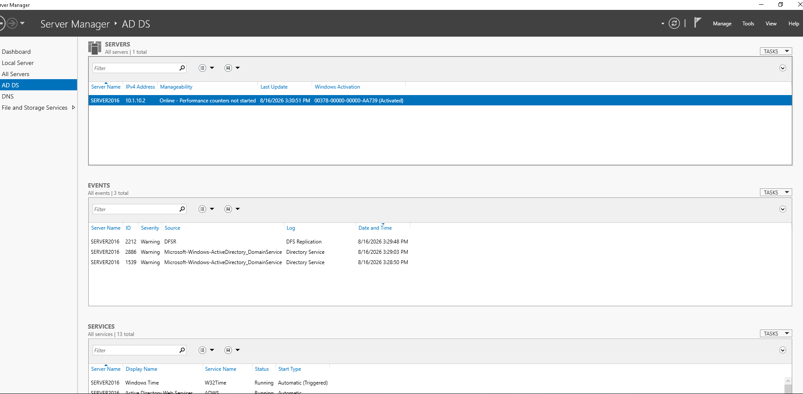
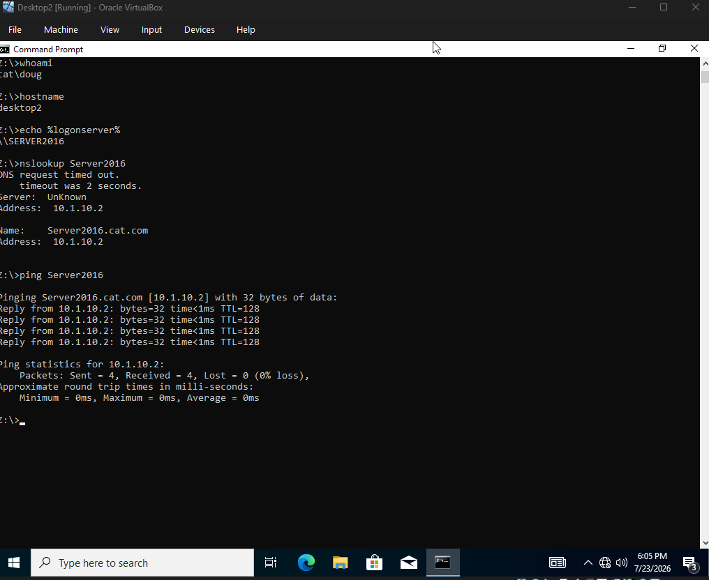
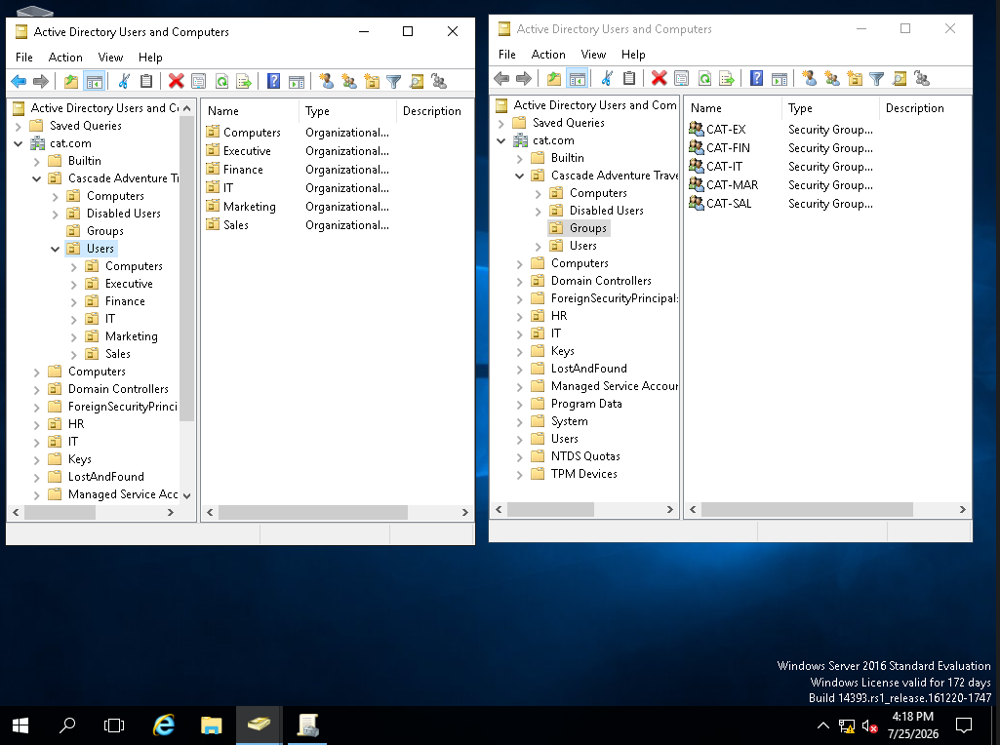
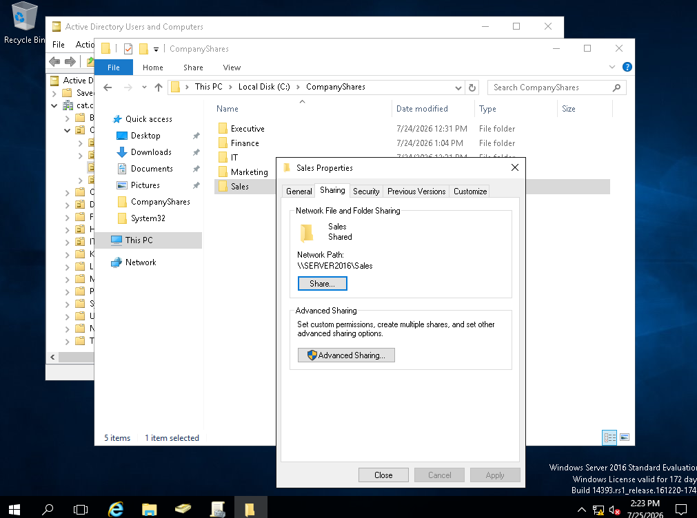
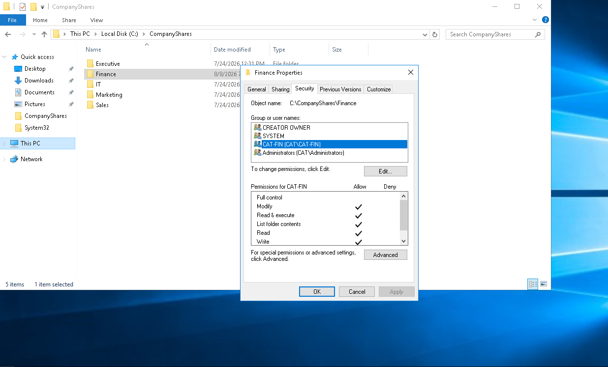
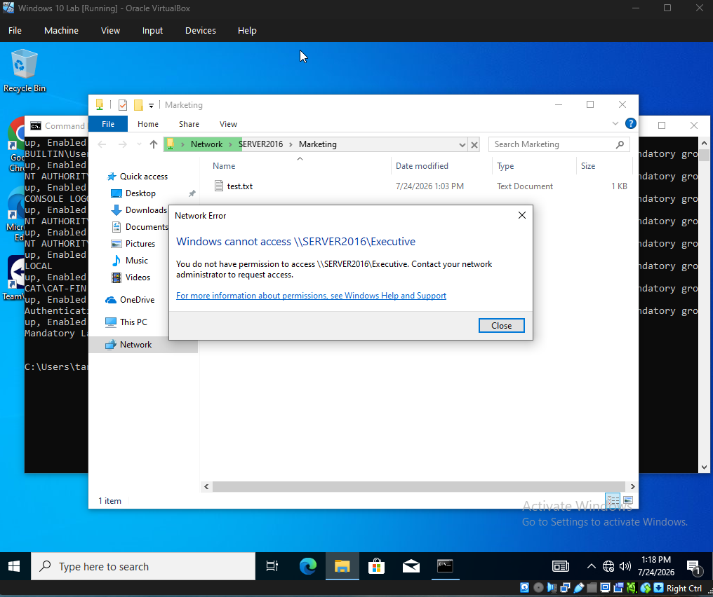
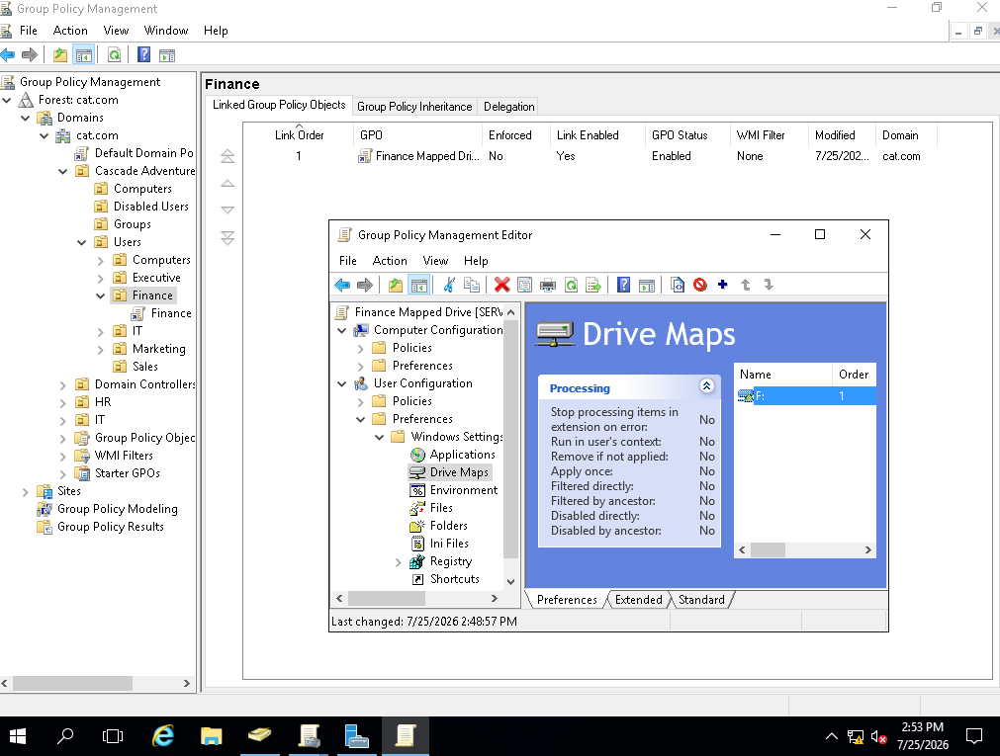
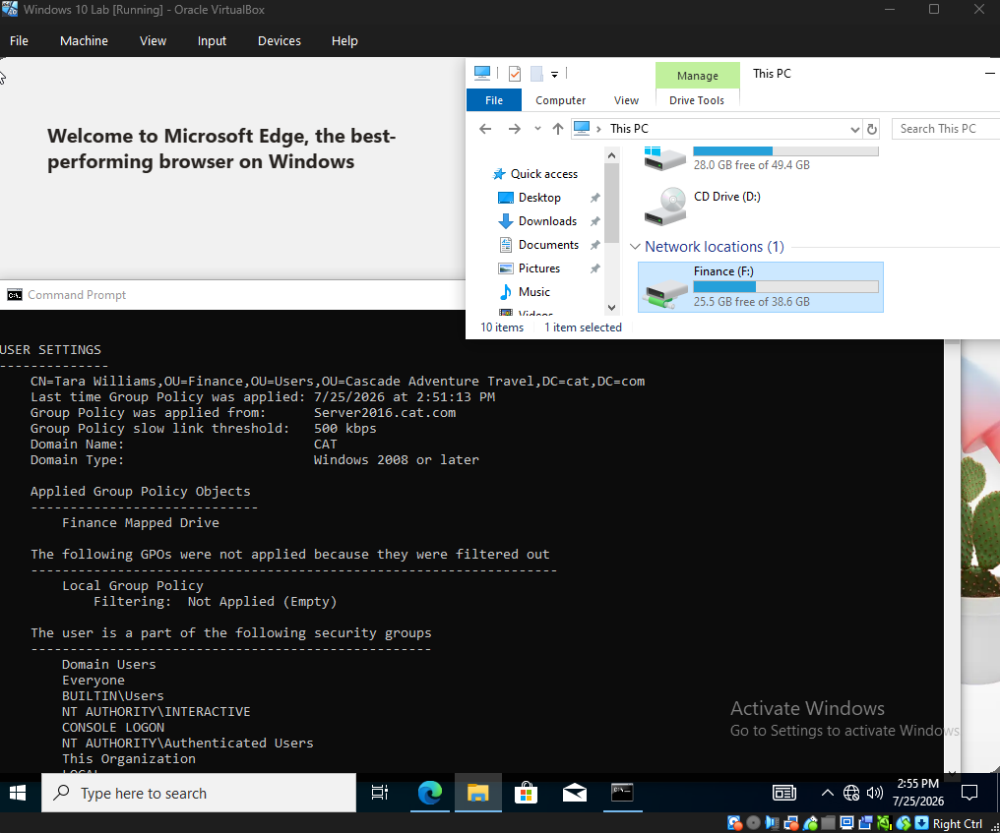
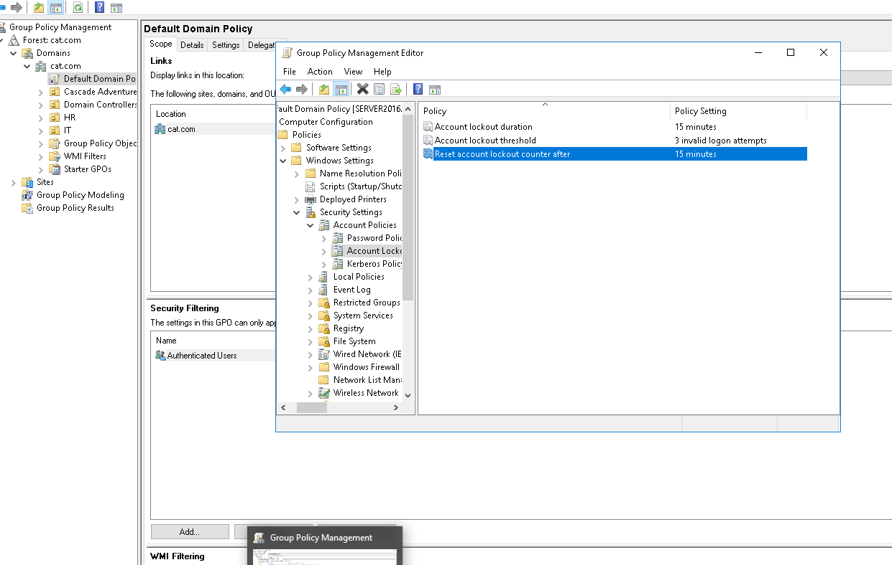
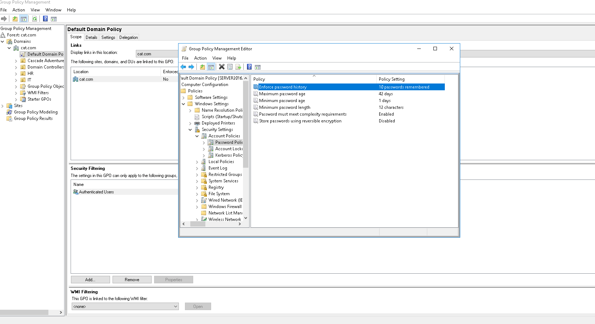

# Overview
I built an Active Directory home lab using Windows Server 2016 and Windows 10 virtual machines. I configured the Windows Server as a domain controller to centrally manage users, computers, security groups, and organizational units for a simulated company. I created departmental file shares, assigned access using group-based permissions and least privilege, and used Group Policy to automatically map network drives for authorized users. I also joined Windows clients to the domain, practiced remote administration using Remote Desktop, configured password and account lockout policies, and troubleshot issues involving DNS, Group Policy, authentication, and shared-folder access.

## Lab Environment

| Component | Configuration |
|---|---|
| **Domain** | `cat.com` |
| **Domain Controller** | `Server2016` |
| **Server OS** | Windows Server 2016 |
| **Client OS** | Windows 10 |
| **Virtualization** | VirtualBox |
| **Server IP** | `10.1.10.2` |
| **Core Technologies** | Active Directory Domain Services (AD DS), DNS, Group Policy |

## Initial Configuration

Before entering Windows, I came up with a mock company called Cascade Adventure Travel. I created the departments the company would need and the users who would be part of the organization.

First, I created a virtualized Windows environment using Windows Server 2016 and Windows 10. I chose to configure the Windows Server VM with a static IP address so it could reliably provide domain and DNS services to client machines.

I installed the Active Directory Domain Services (AD DS) role on Windows Server 2016 and promoted the server to a domain controller for the cat.com domain. This established the server as the central system for managing users, computers, groups, authentication, and Group Policy within the lab environment.

Because Active Directory relies heavily on DNS, I configured the Windows 10 client to use the domain controller as its DNS server. I then joined the Windows 10 machine to the cat.com domain and verified that it could communicate with and authenticate against the domain controller.

After the client was successfully joined to the domain, I tested the environment by logging in with a domain user account and using commands such as whoami, nslookup, and ping to verify domain authentication, DNS resolution, and network connectivity.

This screenshot verifies that the Windows 10 client is logged in with the domain account cat\doug and authenticated by the SERVER2016 domain controller. It also confirms that DNS resolves Server2016 to the IP address 10.1.10.2 and that the client can successfully communicate with the server using ping. 

**Commands used:**

- `whoami` — verified that I was logged in with a domain account (`CAT\doug`).
- `hostname` — confirmed the Windows 10 client name (`desktop2`).
- `echo %logonserver%` — confirmed the client was authenticating against `SERVER2016`.
- `nslookup SERVER2016` — verified DNS resolution for the domain controller.
- `ping SERVER2016` — confirmed network connectivity between the client and server.

## Identity Management & Organization

I organized the simulated company’s Active Directory environment using department-based Organizational Units (OUs) and security groups. Users were organized into OUs based on their department, including Executive, Finance, IT, Marketing, and Sales.

I also created departmental security groups such as `CAT-FIN`, `CAT-IT`, and `CAT-MAR` and added users to the appropriate groups based on their job role. These groups were later used to control access to departmental file shares, allowing permissions to be managed at the group level rather than individually for each user.

## Department File Shares and Permissions

I created centralized departmental folders under `C:\CompanyShares`, including folders for Executive, Finance, IT, Marketing, and Sales. I shared these folders over the network using SMB paths such as `\\SERVER2016\Sales`.

I then configured NTFS permissions through the folders' Security settings. Rather than assigning access directly to individual users, I used department-based Active Directory security groups.
For example, the `CAT-FIN` security group was granted **Modify** permission on the Finance folder. This allowed Finance users to read, create, edit, and delete files while avoiding unnecessary Full Control permissions.

To verify that the access controls were working, I tested the network shares using users from different departments. An authorized user could access their assigned departmental share, while a user without the appropriate permissions was denied access to the Executive share.

This confirmed that departmental resources were available over the network while NTFS permissions and Active Directory security groups restricted access to authorized users.

## Group Policy and Mapped Drives

After configuring access to the departmental file shares, I used Group Policy to automatically map those shared folders as network drives for the appropriate users.

I created a Group Policy Object (GPO) that mapped departmental shares, such as `\\SERVER2016\Finance`, so users could access their assigned resources directly through File Explorer. The policy was targeted to the appropriate users based on the Active Directory structure and group membership configured in the lab.

After configuring the drive mapping, I ran:

`gpupdate /force`

on the Windows 10 client to refresh Group Policy. I then used:

`gpresult /r`

to verify that the expected Group Policy Object had been applied to the logged-in user.

I confirmed that the appropriate departmental network drive appeared automatically for the user and provided access to the correct shared folder.

## Security Policies

I configured account lockout and password policies to better secure the domain and user accounts.

Account Lockout Policy
Account lockout threshold: 3 failed attempts
Account lockout duration: 15 minutes
Reset account lockout counter after: 15 minutes

I configured account lockout after three failed sign-in attempts to reduce the risk of repeated password-guessing attacks. The account remains locked for 15 minutes before the user can attempt to sign in again.

Password Policy
Minimum password length: 12 characters
Password complexity requirements: Enabled
Password history: 10 passwords remembered

I increased the minimum password length from 8 to 12 characters and enabled complexity requirements to encourage stronger passwords. I also configured password history to remember the previous 10 passwords, helping prevent users from immediately reusing old passwords.

## Troubleshooting and Validation

Throughout the lab, I encountered several configuration and access issues that required me to verify settings rather than only following the initial setup steps. These problems helped me better understand how DNS, Group Policy, security groups, and NTFS permissions work together in an Active Directory environment.

### DNS Configuration Issue

At one point, the Windows 10 client was unable to correctly resolve domain resources because its DNS configuration was pointing to an external DNS server instead of the domain controller.

To troubleshoot the issue, I used commands such as:

ipconfig /all
nslookup
ping

I reviewed the client's network configuration and confirmed that the DNS server was incorrect. I changed the Windows 10 client to use SERVER2016 as its DNS server.

After correcting the DNS settings, the client was able to resolve domain resources correctly and communicate with the cat.com domain controller.

### Department Folder Access Issue

I also encountered an issue where a user could not access the departmental folder they were supposed to have access to.

I checked the user's Active Directory group membership and compared it with the permissions configured on the departmental share. I found that the user was not a member of the correct department security group.

I added the user to the appropriate departmental security group and refreshed the user's session. I also ran `gpupdate /force` to ensure the mapped-drive Group Policy was current and used `gpresult /r` to verify that the expected GPO was being applied.

After updating the user's group membership and refreshing policy, the user was able to access the correct departmental resources.

## Project Summary

This project gave me hands-on experience with several key concepts involved in setting up and managing a Windows domain environment. I learned how organizations can use Windows Server, Active Directory, security groups, and Group Policy to centrally manage users, computers, and access to resources.

I practiced applying least privilege and role-based access by creating departmental groups, assigning permissions, and controlling access to shared network folders. I also configured account lockout and password policies to improve the security posture of the domain.

I created shared departmental folders, assigned access through security groups, and used Group Policy to automatically map those network drives to the correct users. I also practiced tasks such as password resets, account management, and remote access within the lab environment.

Overall, this project helped me better understand how users, computers, DNS, Active Directory, Group Policy, and file permissions work together to manage a workplace environment.
